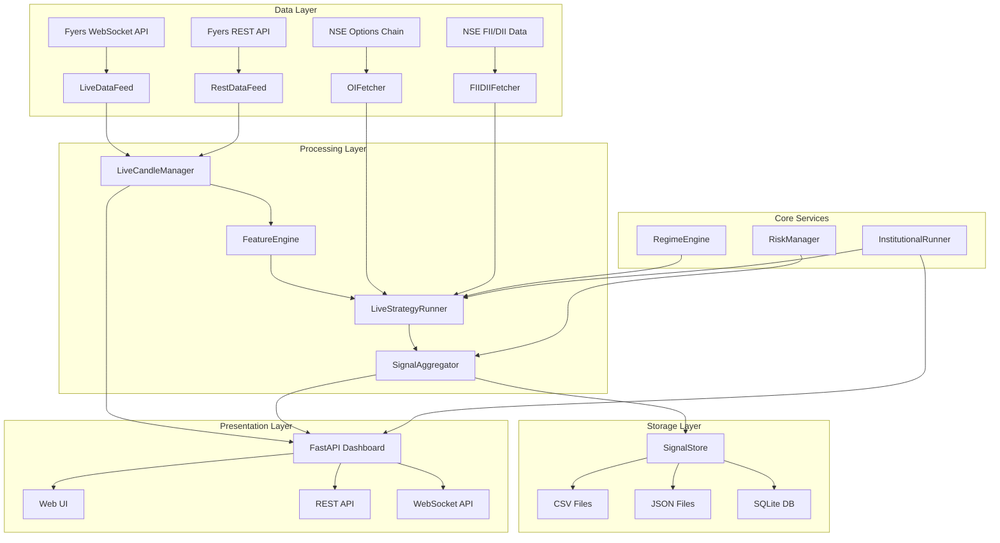
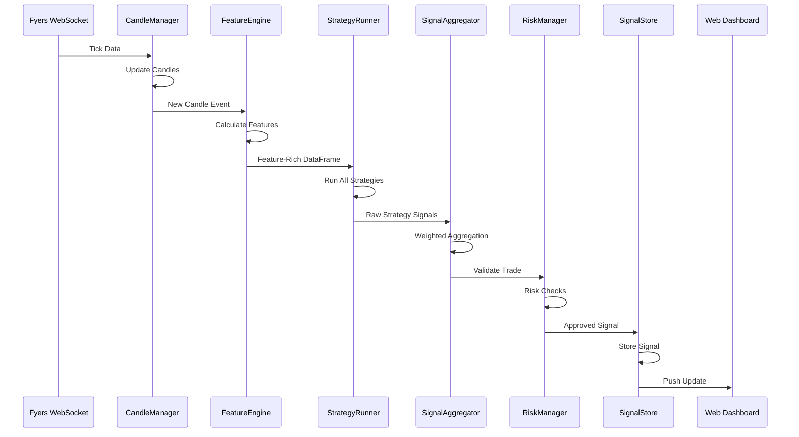

# Mini-Simon

## Project Overview

**Mini-Simon** is an institutional-grade real-time trading signal generation system for Indian financial markets. It combines Smart Money Concepts (SMC), institutional data analysis, and multi-strategy aggregation to generate high-confidence trading signals across NSE Indices, MCX Commodities, and Equity segments.

### Problem Solved
- **Information Overload**: Traders struggle to process multiple data sources (OI, PCR, FII/DII, price action) simultaneously
- **Strategy Fragmentation**: Most traders rely on single-strategy approaches leading to false signals
- **Real-Time Complexity**: Manual analysis of institutional data during market hours is error-prone
- **Risk Management**: Inconsistent position sizing and risk controls lead to avoidable losses

### Business Objective
- Provide institutional-grade signal generation for retail and proprietary traders
- Automate complex multi-factor analysis in real-time
- Deliver actionable signals with complete audit trails
- Enable paper trading and live deployment with minimal configuration

### Trading Objective
- Generate high-conviction signals using confluence of multiple institutional strategies
- Achieve 1:3 risk-reward ratio with ATR-based position sizing
- Limit maximum drawdown through regime-based filtering and risk controls
- Support multiple market segments (Index, MCX, Equity) with segment-specific strategies

### Target Users
- **Proprietary Traders**: Need real-time institutional signals for day trading
- **Algorithmic Traders**: Require API-accessible signal feeds for automated execution
- **Retail Traders**: Want institutional-grade analysis without manual effort
- **Quant Researchers**: Need backtesting framework for strategy validation

## System Architecture

### High-Level Architecture



### Component-wise Explanation

#### Data Layer
- **LiveDataFeed**: Primary WebSocket connection to Fyers API for real-time tick data
- **RestDataFeed**: Fallback REST API polling when WebSocket unavailable
- **OIFetcher**: Fetches NSE options chain data (PCR, OI bias, max pain) every 30 minutes
- **FIIDIIFetcher**: Fetches daily FII/DII net activity around 09:05 IST

#### Processing Layer
- **LiveCandleManager**: Aggregates ticks into time-based candles (1m, 3m, 5m, 15m, 60m, 1D)
- **FeatureEngine**: Computes 50+ technical features (VWAP, ATR, volume ratios, swing points, liquidity sweeps)
- **LiveStrategyRunner**: Executes all enabled strategies on candle data
- **SignalAggregator**: Combines multiple strategy signals using weighted confluence logic

#### Core Services
- **RegimeEngine**: Classifies market regime (TRENDING_BULLISH, TRENDING_BEARISH, RANGING, DISTRIBUTION)
- **RiskManager**: Validates trades, calculates position sizes, manages daily loss limits
- **InstitutionalRunner**: Orchestrates institutional strategies with 5-minute aggregation cycles

#### Storage Layer
- **SignalStore**: Multi-format storage (CSV, JSON, SQLite) with daily rotation
- **Audit Logging**: Permanent audit trail in `logs/strategy_signals.log`

#### Presentation Layer
- **FastAPI Dashboard**: Web interface for real-time monitoring
- **REST API**: Programmatic access to signals and market data
- **WebSocket API**: Real-time push updates to connected clients

### Data Flow



## Technology Stack

### Languages
- **Python 3.10+**: Core application language
- **JavaScript**: Frontend dashboard (embedded in templates)

### Libraries

#### Core Data & Math
- **pandas >= 1.5.0**: Data manipulation and analysis
- **numpy >= 1.24.0**: Numerical computations

#### Trading API
- **fyers-apiv3 >= 3.0.0**: Fyers API integration (WebSocket + REST)

#### Web Framework
- **fastapi >= 0.110.0**: REST API framework
- **uvicorn[standard] >= 0.27.0**: ASGI server
- **jinja2 >= 3.1.0**: Template engine

#### Data Storage
- **openpyxl >= 3.0.0**: Excel file support
- **xlsxwriter >= 3.0.0**: Excel writing
- **sqlite3**: Embedded database (Python stdlib)

#### WebSocket & Async
- **websocket-client >= 1.6.1**: WebSocket client
- **websockets >= 12.0**: WebSocket server
- **aiohttp >= 3.8.4**: Async HTTP client
- **aiodns >= 3.0.0**: Async DNS resolution

#### Time & Date
- **pytz >= 2024.1**: Timezone handling (IST)
- **python-dateutil >= 2.8.0**: Date parsing

#### Configuration
- **pyyaml >= 6.0.0**: YAML config support
- **python-dotenv >= 1.0.0**: Environment variable management

#### Validation
- **pydantic >= 2.0.0**: Data validation

#### HTTP Client
- **requests >= 2.31.0**: HTTP requests
- **urllib3 >= 2.0.0**: HTTP library

#### Monitoring
- **psutil >= 5.9.0**: System monitoring

#### Security
- **cryptography >= 42.0.0**: Cryptographic operations

#### Notifications (Optional)
- **discord-webhook >= 1.0.0**: Discord notifications

### APIs
- **Fyers API v3**: Primary data source for price data and historical candles
- **NSE API**: Options chain data (OI, PCR, max pain)
- **NSE API**: FII/DII daily activity data

### Databases
- **SQLite**: Embedded database for signal storage (optional, CSV/JSON default)
- **CSV Files**: Primary signal storage format
- **JSON Files**: Secondary signal storage format

### Infrastructure
- **Fly.io**: Cloud deployment platform (24/7 operation)
- **PythonAnywhere**: Alternative cloud hosting
- **Docker**: Containerization for deployment
- **Nginx**: Reverse proxy (production deployments)

## Folder Structure

```
mini-simon/
├── backtest/                          # Backtesting framework
│   ├── __init__.py
│   └── registry.py                    # Strategy registry for backtesting
│
├── core/                              # Core trading services
│   ├── __init__.py
│   ├── institutional_runner.py        # Institutional strategy orchestrator
│   ├── regime_engine.py               # Market regime classification
│   ├── risk_manager.py                # Risk management and position sizing
│   └── signal_aggregator.py          # Signal aggregation logic
│
├── data/                              # External data fetchers
│   ├── __init__.py
│   ├── _http_utils.py                 # HTTP utilities for NSE API
│   ├── fii_dii_fetcher.py             # FII/DII data fetcher
│   └── oi_fetcher.py                  # Options chain data fetcher
│
├── deploy/                            # Deployment configurations
│   ├── .env.production.template       # Production environment template
│   ├── COMMANDS-CHEATSHEET.md         # Deployment command reference
│   ├── DEPLOYMENT-SUMMARY.md          # Deployment documentation
│   ├── README-DEPLOYMENT.md           # Deployment guide
│   ├── README-TOKEN-MANAGEMENT.md    # Token refresh guide
│   ├── ecosystem.config.js            # PM2 process manager config
│   ├── health_check.py                # Health check endpoint
│   ├── launch.sh                      # Deployment launch script
│   ├── nginx-mini-simon.conf          # Nginx configuration
│   ├── run_production.py              # Production entry point
│   ├── setup_token_refresh.sh         # Token refresh setup
│   ├── token_manager.py               # Fyers token management
│   └── websocket_manager_cloud.py     # Cloud WebSocket manager
│
├── logs/                              # Log files (generated at runtime)
│   ├── live_engine.log                # Main engine logs
│   ├── strategy_signals.log           # Strategy signal audit trail
│   └── cloud_deploy.log               # Deployment logs
│
├── signals/                           # Signal storage (generated at runtime)
│   └── {YYYY-MM-DD}/                  # Daily rotated signal files
│       ├── signals_{date}.csv
│       └── signals_{date}.json
│
├── static/                            # Static assets for web dashboard
│   └── (CSS, JS, images)
│
├── strategies/                        # Trading strategies
│   ├── __init__.py
│   ├── base_strategy.py               # Abstract base class for strategies
│   ├── equity/                        # Equity segment strategies
│   │   ├── __init__.py
│   │   ├── delivery_accumulation.py   # Delivery accumulation strategy
│   │   └── rs_breakout.py             # Relative strength breakout
│   ├── index/                         # Index segment strategies
│   │   ├── __init__.py
│   │   ├── gap_trap.py                # Opening gap trap strategy
│   │   ├── oi_directional.py          # OI + FII directional strategy
│   │   └── vwap_institutional.py     # VWAP bounce/rejection strategy
│   └── mcx/                           # MCX commodity strategies
│       ├── __init__.py
│       ├── session_breakout.py        # Session breakout strategy
│       └── spread_correlation.py      # Spread mean-reversion strategy
│
├── templates/                         # Jinja2 templates for web dashboard
│   └── (HTML templates)
│
├── trades/                            # Trade records (generated at runtime)
│
├── .devcontainer/                     # VS Code dev container config
├── .env                               # Environment variables (local)
├── .env.example                       # Environment variables template
├── .gitignore                         # Git ignore rules
├── Dockerfile                         # Docker container definition
├── fly.toml                           # Fly.io deployment config
├── cloud_utils.py                     # Cloud utility functions
├── config.py                          # Configuration management
├── credentials.py                     # Credential management
├── feature_engine.py                 # Technical feature calculation
├── fetch_historical.py               # Historical data fetcher
├── live_data_feed.py                  # WebSocket data feed
├── live_engine.py                     # Main engine orchestrator
├── live_signal_aggregator.py          # Signal aggregation
├── live_strategy_runner.py            # Strategy execution runner
├── logger_config.py                   # Logging configuration
├── mcx_symbols.py                     # MCX symbol management
├── nifty_dashboard.py                 # Nifty dashboard (legacy)
├── requirements.txt                   # Python dependencies
├── rest_data_feed.py                  # REST API data feed (fallback)
├── run.py                             # FastAPI dashboard entry point
├── run_live_engine.py                # Live engine entry point
├── signal_store.py                    # Signal storage system
├── strategies_config.py               # Strategy and risk parameters
├── utils.py                           # Utility functions
├── web_main.py                        # FastAPI application
└── websocket_manager.py               # WebSocket connection manager
```

### Folder Explanations

- **backtest/**: Contains backtesting registry and strategy mappings for historical testing
- **core/**: Core trading services including regime detection, risk management, and institutional strategy orchestration
- **data/**: External data fetchers for NSE options chain and FII/DII data
- **deploy/**: Complete deployment configuration for Fly.io, Docker, and production environments
- **logs/**: Runtime log files with daily rotation for strategy signals audit trail
- **signals/**: Signal storage with daily rotation, supports CSV, JSON, and SQLite formats
- **static/**: Static assets (CSS, JavaScript, images) for the web dashboard
- **strategies/**: All trading strategies organized by segment (equity, index, mcx)
- **templates/**: Jinja2 HTML templates for the FastAPI dashboard
- **trades/**: Trade execution records (when live trading is enabled)

## Features Implemented

### Core Features
- **Real-Time Data Feed**: WebSocket connection to Fyers API with automatic REST fallback
- **Multi-Timeframe Analysis**: Supports 1m, 3m, 5m, 15m, 60m, 120m, 180m, 240m, 1D timeframes
- **Multi-Segment Coverage**: NSE Indices (Nifty-50, Bank-Nifty, Sensex), MCX Commodities (Gold, Silver, Crude), Equities (Nifty-50 stocks)
- **Institutional Data Integration**: Real-time OI/PCR, FII/DII bias, max pain levels
- **Market Regime Detection**: Automatic classification of trending, ranging, and distribution regimes
- **Smart Money Concepts**: Liquidity sweeps, swing points, order blocks, fair value gaps
- **Volume Analysis**: Volume spike detection, volume ratio calculations, price-volume divergence
- **Signal Aggregation**: Weighted confluence of multiple strategies with confidence scoring
- **Risk Management**: ATR-based position sizing, daily loss limits, max open trades
- **Audit Logging**: Permanent audit trail of all strategy signals with timestamps
- **Web Dashboard**: Real-time monitoring interface with live charts and signal display
- **REST API**: Programmatic access to signals, market data, and system status
- **Cloud Deployment**: Fly.io deployment support with 24/7 operation
- **Paper Trading Mode**: Risk-free testing environment
- **Signal Storage**: Multi-format storage (CSV, JSON, SQLite) with daily rotation

### Advanced Features
- **Automatic Token Refresh**: Fyers API token auto-refresh for uninterrupted operation
- **Health Monitoring**: System health checks with automatic restart on failure
- **WebSocket Reconnection**: Automatic reconnection with exponential backoff
- **Market Hours Detection**: Automatic market hours detection for Indian markets
- **Session-Based Features**: Morning, midday, afternoon, and closing session analysis
- **Spread Correlation**: Inter-commodity spread analysis for mean-reversion trades
- **Relative Strength**: Stock performance relative to Nifty benchmark
- **Delivery Analysis**: Delivery-based accumulation/distribution detection
- **Gap Trading**: Opening gap trap detection for fade trades
- **VWAP Analysis**: Institutional VWAP bounce and rejection signals

## Trading Logic

### Entry Conditions

#### Index Strategies

**OI Directional Strategy**
- **Long Entry**: PCR > 1.3 AND FII bias = BULLISH AND regime = TRENDING_BULLISH AND price within 0.2% of VWAP
- **Short Entry**: PCR < 0.7 AND FII bias = BEARISH AND regime = TRENDING_BEARISH AND price rejects VWAP from above
- **Time Window**: 09:30 - 15:10 IST

**VWAP Institutional Strategy**
- **Long Entry**: Previous close below VWAP, current candle bounces from VWAP with volume ratio > 1.5, bullish candle
- **Short Entry**: Previous close above VWAP, current candle rejects VWAP with volume ratio > 1.5, bearish candle
- **Regime Filter**: Excludes RANGING regime
- **Time Window**: 09:30 - 14:45 IST

**Gap Trap Strategy**
- **Long Entry**: Gap down > 0.3%, first candle closes bullish with volume ratio > 1.3
- **Short Entry**: Gap up > 0.3%, first candle closes bearish with volume ratio > 1.3
- **Target**: Previous day's close
- **Time Window**: 09:15 - 09:35 IST only

#### MCX Strategies

**Session Breakout Strategy**
- **Long Entry**: Price breaks above 6-candle consolidation range with volume ratio > 1.5 AND OI increasing
- **Short Entry**: Price breaks below 6-candle consolidation range with volume ratio > 1.5 AND OI increasing
- **Time Windows**: London open (11:30-12:30 IST) OR US open (18:30-19:30 IST)

**Spread Correlation Strategy**
- **Long Entry**: Z-score of spread ratio > 2.0 (long secondary commodity)
- **Short Entry**: Z-score of spread ratio < -2.0 (short secondary commodity)
- **Exit**: Z-score returns to within 0.1 of mean
- **Pairs**: Gold/Silver, Crude/NatGas

#### Equity Strategies

**Delivery Accumulation Strategy**
- **Long Entry**: Stock flagged as ACCUMULATION, price pulls back to 21 EMA within 1%, volume ratio < 1.0, regime = TRENDING_BULLISH
- **Filter**: Excludes DISTRIBUTION flagged stocks
- **Time Window**: 09:30 - 15:10 IST

**RS Breakout Strategy**
- **Long Entry**: RS score > 0 (outperforming Nifty), RS increasing, made 20-day high, pullback to 21 EMA, volume ratio < 2.0
- **Lookback**: 20 days for RS calculation
- **Time Window**: 09:30 - 15:10 IST

### Exit Conditions

**Stop Loss**
- ATR-based: 1.5x ATR for index strategies, 2.0x ATR for MCX strategies
- Percentage-based: 1% for equity strategies
- Trailing Stop: Breakeven at +1 ATR, trail at 1 ATR below price at +2 ATR

**Take Profit**
- Risk-Reward Ratio: 1:3 default (3% target for 1% risk)
- ATR-based: 2.5x ATR for index strategies, 2x ATR for MCX strategies
- Percentage-based: 3-5% for equity strategies

**Time-Based Exit**
- End of trading day for intraday strategies
- Session end for MCX session strategies

### Risk Management

**Position Sizing**
- Risk per trade: 1% of capital (configurable via `RISK_PER_TRADE`)
- ATR multiplier: INDEX=1.5x, MCX=2.0x, EQUITY=1.2x
- FII bearish reduction: 50% size reduction when FII bias = BEARISH
- Formula: `Position Size = (Capital × Risk%) / (ATR × Multiplier)`

**Position Limits**
- Max open trades: 3 total (configurable via `MAX_OPEN_TRADES`)
- Max per segment: 1 trade per segment (INDEX, MCX, EQUITY)
- Daily loss limit: 2% of capital (configurable via `DAILY_LOSS_LIMIT_PCT`)

**Regime Filters**
- RANGING regime: No new positions allowed
- DISTRIBUTION regime: No long positions allowed
- TRENDING regimes: Aligned signals only

**Time Filters**
- Expiry day restriction: No trades in first 30 minutes on Thursday (expiry day)
- Market hours: Indian equity 09:15-15:30, MCX 09:00-23:30
- Strategy-specific windows: Gap trap (09:15-09:35), VWAP (09:30-14:45)

### Smart Money Concepts Used

**Liquidity Sweep Logic**
- Detects swing highs/lows using lookback period (default 5 bars)
- Identifies sweeps when price penetrates recent swing levels
- Triggers signals on reversal candles after sweep
- Implementation: `LiquiditySweepDetector` in `feature_engine.py`

**Order Block Detection**
- Identifies strong bullish/bearish candles followed by consolidation
- Marks order block levels for future retests
- Used in conjunction with liquidity sweeps for entry confirmation
- Implementation: Wick features and body imbalance detection in `feature_engine.py`

**Fair Value Gaps (FVG)**
- Detects imbalances between candle 1 high and candle 3 low (bullish FVG)
- Detects imbalances between candle 1 low and candle 3 high (bearish FVG)
- Monitors for FVG fills and retests
- Implementation: `_detect_fvg_and_ob()` in `web_main.py`

**Market Structure Logic**
- Swing point detection with strength scoring
- Higher highs/higher lows (uptrend) and lower highs/lower lows (downtrend)
- Structure break identification for trend reversal confirmation
- Implementation: `SwingPointDetector` in `feature_engine.py`

### Volume Logic

**Volume Spike Detection**
- Volume ratio calculation: Current volume / 20-period average
- Spike threshold: 2.0x average volume (configurable)
- Used for breakout confirmation and trap detection
- Implementation: `VolumeFeatures` in `feature_engine.py`

**Volume Trend Analysis**
- Volume moving averages for trend identification
- Price-volume divergence detection (up price with down volume)
- Relative volume calculation (50-period average)
- Implementation: `VolumeFeatures` in `feature_engine.py`

**Volume Profile**
- Session-based volume analysis (morning, midday, afternoon, closing)
- Volume at key levels (swing points, VWAP)
- Used for institutional activity detection

### Additional Strategies

**Institutional Data Strategies**
- OI/PCR analysis for sentiment
- FII/DII flow for institutional bias
- Max pain calculation for option expiry targets
- Implementation: `oi_fetcher.py` and `fii_dii_fetcher.py`

**Statistical Arbitrage**
- Spread correlation between related commodities
- Z-score based mean reversion
- Pairs trading logic
- Implementation: `SpreadCorrelationStrategy` in `strategies/mcx/`

**Momentum Strategies**
- Relative strength vs benchmark
- Breakout pullback logic
- EMA crossover confirmation
- Implementation: `RSBreakoutStrategy` in `strategies/equity/`

## Data Pipeline

### Data Source

**Primary Data Source: Fyers API v3**
- **WebSocket Feed**: Real-time tick data for all subscribed symbols
- **REST API**: Historical candle data, current prices, market status
- **Coverage**: NSE Equities, NSE Indices, MCX Commodities
- **Update Frequency**: Real-time (WebSocket) or 30-second polling (REST fallback)

**Secondary Data Sources: NSE API**
- **Options Chain**: OI, PCR, max pain for NIFTY, BANKNIFTY, SENSEX
- **FII/DII Data**: Daily net activity of foreign institutional investors
- **Update Frequency**: Options chain every 30 minutes, FII/DII daily at 09:05 IST

### Data Cleaning

**Tick Data Processing**
- Timestamp alignment to IST timezone
- Duplicate tick removal
- Out-of-hours tick filtering
- Price validation (positive, finite values)
- Volume validation (non-negative integers)

**Candle Construction**
- Time-based aggregation (1m, 3m, 5m, 15m, 60m, 1D)
- OHLCV calculation from ticks
- Gap handling (market open/close)
- Missing data interpolation (linear for price, zero for volume)

**Data Validation**
- OHLC relationship validation (high >= open, close, low; low <= open, close, high)
- Volume consistency checks
- Timestamp monotonicity
- Duplicate candle removal
- NaN/null value handling

### Feature Engineering

**Price-Based Features**
- Returns (simple and log)
- Price change percentage
- Absolute price change
- Body and wick ratios
- Candle patterns (doji, hammer, engulfing)

**Volume-Based Features**
- Volume ratio (current / average)
- Volume spike detection
- Volume trend (above/below average)
- Relative volume (50-period average)
- Price-volume divergence

**Technical Indicators**
- VWAP (Volume Weighted Average Price)
- VWAP bands (2 standard deviations)
- ATR (Average True Range)
- ATR percentage
- ATR bands
- Moving averages (EMA 5, SMA 10, SMA 20)
- MA crossovers
- MA slopes
- Trend strength

**Smart Money Features**
- Swing points (highs and lows)
- Swing strength scoring
- Liquidity sweeps (up and down)
- Body imbalance detection
- Fair value gaps (FVG)
- Order block levels

**Market Structure Features**
- Trend direction (up/down)
- Trend strength
- Price relative to MAs
- Regime classification
- Session information

**Time-Based Features**
- Hour of day
- Day of week
- Session classification (morning, midday, afternoon, closing)
- Time to market close

### Storage Structure

**Signal Storage**
- **Format**: CSV, JSON, SQLite (configurable)
- **Rotation**: Daily (midnight)
- **Location**: `signals/{YYYY-MM-DD}/`
- **Retention**: 30 days (configurable)
- **Fields**: symbol, action, confidence, entry_price, stop_loss, target, timestamp, contributing_strategies, etc.

**Log Storage**
- **Format**: Text files with rotation
- **Rotation**: Size-based (100MB) or time-based (daily)
- **Location**: `logs/`
- **Retention**: 5 backup files
- **Types**: Main engine logs, strategy signal audit logs, deployment logs

**Data Storage**
- **Historical Data**: Cached in memory (500 candles per symbol/timeframe)
- **Market Data**: Not persisted (fetched fresh on restart)
- **Configuration**: Environment variables and config files

## Backtesting Framework

### Methodology

**Strategy Registry**
- Central strategy registry in `backtest/registry.py`
- Strategy display names and key mappings
- Support for individual and combined strategy backtesting

**Backtest Execution**
- Historical data fetching from Fyers API
- Feature calculation on historical candles
- Strategy signal generation on historical data
- Signal aggregation using same logic as live trading
- Trade simulation with slippage and transaction costs

**Performance Metrics**
- Total trades
- Win rate
- Average profit/loss per trade
- Maximum drawdown
- Profit factor
- Sharpe ratio (if sufficient data)
- Average holding period

### Metrics Calculated

**Return Metrics**
- Total return
- Annualized return
- Cumulative returns
- Rolling returns

**Risk Metrics**
- Maximum drawdown
- Average drawdown
- Drawdown duration
- Volatility (standard deviation)
- Value at Risk (VaR)

**Trade Metrics**
- Win rate
- Average win
- Average loss
- Profit factor
- Risk-reward ratio
- Average holding period

**Efficiency Metrics**
- Sharpe ratio
- Sortino ratio
- Calmar ratio
- Win/Loss ratio

### Reports Generated

**CSV Reports**
- Trade-by-trade log
- Signal-by-signal log
- Performance summary
- Strategy comparison

**Excel Reports**
- Detailed trade log with all parameters
- Equity curve
- Drawdown chart
- Monthly performance breakdown

**JSON Reports**
- Machine-readable performance data
- Strategy parameters
- Backtest configuration

### Output Files

**Signal Files**
- `signals_{YYYYMMDD_HHMMSS}.csv`: All generated signals
- `final_scan_execution_{YYYYMMDD_HHMMSS}.csv`: Aggregated scan results
- `final_scan_audit.json`: Audit log with validation statistics

**Performance Files**
- `backtest_results_{strategy}_{YYYYMMDD}.xlsx`: Detailed backtest results
- `performance_summary_{YYYYMMDD}.json`: Performance metrics
- `equity_curve_{strategy}.csv`: Equity curve data

**Log Files**
- `backtest_{timestamp}.log`: Backtest execution log
- `strategy_performance.log`: Strategy-specific performance logs

## Configuration Guide

### Environment Variables

**Fyers API Credentials**
```bash
FYERS_APP_ID=your_app_id
FYERS_ACCESS_TOKEN=your_access_token
FYERS_CLIENT_ID=your_client_id
```

**WebSocket Configuration**
```bash
WS_MAX_RECONNECT_ATTEMPTS=10
WS_RECONNECT_DELAY=5
WS_HEARTBEAT_INTERVAL=30
WS_TICK_TIMEOUT=90
```

**Trading Configuration**
```bash
PAPER_TRADING_MODE=true
RISK_PER_TRADE=1.0
ACCOUNT_SIZE=100000
ENABLE_MCX=true
```

**Logging Configuration**
```bash
LOG_LEVEL=INFO
LOG_FORMAT=%(asctime)s - %(name)s - %(levelname)s - %(message)s
```

**Cloud Configuration (Fly.io)**
```bash
FLY_IO=true
FLY_APP_NAME=mini-simon
FLY_REGION=blr
PORT=8080
```

### Strategy Parameters

**OI Directional Strategy**
```python
"OIDirectional": {
    "pcr_bull_threshold": 1.3,
    "pcr_bear_threshold": 0.7,
    "vwap_proximity_pct": 0.2,
}
```

**Gap Trap Strategy**
```python
"GapTrap": {
    "min_gap_pct": 0.3,
    "volume_ratio_min": 1.3,
}
```

**MCX Session Breakout Strategy**
```python
"MCXSessionBreakout": {
    "london_open": "11:30",
    "us_open": "18:30",
    "volume_ratio_min": 1.5,
    "consolidation_candles": 6,
}
```

**Spread Correlation Strategy**
```python
"SpreadCorrelation": {
    "zscore_entry": 2.0,
    "zscore_exit": 0.0,
    "zscore_stop": 3.0,
    "lookback_days": 20,
}
```

**RS Breakout Strategy**
```python
"RSBreakout": {
    "rs_lookback_days": 20,
    "volume_ratio_min": 2.0,
    "target_pct": 5.0,
}
```

**Delivery Accumulation Strategy**
```python
"DeliveryAccumulation": {
    "delivery_threshold_pct": 60,
    "target_pct": 3.0,
}
```

### Risk Parameters

```python
RISK_PARAMS = {
    "max_risk_per_trade_pct": 1.0,      # 1% risk per trade
    "max_open_trades": 3,               # Maximum 3 open trades
    "daily_loss_limit_pct": 2.0,        # 2% daily loss limit
    "atr_multiplier": {
        "INDEX": 1.5,                   # 1.5x ATR for indices
        "MCX": 2.0,                     # 2.0x ATR for commodities
        "EQUITY": 1.2,                  # 1.2x ATR for equities
    },
    "fii_bearish_size_reduction": 0.5,  # 50% size reduction when FII bearish
}
```

### Signal Aggregation Parameters

```python
"signal_aggregator": {
    "min_confidence_threshold": 0.2,    # Minimum confidence for signal
    "confluence_threshold": 1,          # Minimum strategies to agree
}
```

### Feature Engine Parameters

```python
"feature_engine": {
    "vwap_lookback": 20,
    "volume_lookback": 20,
    "spike_threshold": 2.0,
    "wick_threshold": 0.3,
    "swing_lookback": 5,
    "strength_threshold": 2,
    "imbalance_threshold": 0.6,
    "atr_period": 14,
    "fast_ma": 10,
    "slow_ma": 20,
}
```

## Installation Guide

### Prerequisites

- Python 3.10 or higher
- pip package manager
- Fyers API account (for live data)
- Git (for cloning repository)

### Step-by-Step Setup

#### 1. Clone Repository

```bash
git clone https://github.com/yourusername/mini-simon.git
cd mini-simon
```

#### 2. Create Virtual Environment

```bash
python -m venv venv
# On Windows
venv\Scripts\activate
# On Linux/Mac
source venv/bin/activate
```

#### 3. Install Dependencies

```bash
pip install -r requirements.txt
```

#### 4. Configure Environment Variables

```bash
# Copy example environment file
cp .env.example .env

# Edit .env file with your credentials
notepad .env  # Windows
nano .env      # Linux/Mac
```

Required variables in `.env`:
```bash
FYERS_APP_ID=your_app_id_here
FYERS_ACCESS_TOKEN=your_access_token_here
```

#### 5. Verify Installation

```bash
# Test Fyers API connection
python test_fyers_auth.py

# Test WebSocket connection
python test_fyers_websocket.py

# Check strategies
python check_strategies.py
```

#### 6. Create Required Directories

```bash
mkdir logs
mkdir signals
mkdir trades
mkdir Data
```

#### 7. Configure Strategies (Optional)

Edit `strategies_config.py` to enable/disable strategies:

```python
ENABLED_STRATEGIES = {
    "OIDirectional": True,
    "VWAPInstitutional": True,
    "GapTrap": True,
    "MCXSessionBreakout": True,
    "SpreadCorrelation": True,
    "DeliveryAccumulation": True,
    "RSBreakout": True,
}
```

#### 8. Update Symbol List (Optional)

Edit `config.py` to customize the watchlist:

```python
"data_feed": {
    "symbols": [
        "RELIANCE",
        "TCS",
        # Add your symbols here
    ],
    "timeframes": ["5m", "15m", "60m"],
}
```

### Troubleshooting Installation

**Issue: Import errors for fyers_apiv3**
```bash
pip install --upgrade fyers-apiv3
```

**Issue: WebSocket connection fails**
- Check firewall settings
- Verify Fyers API credentials
- Ensure network connectivity

**Issue: Module not found errors**
```bash
pip install -r requirements.txt --force-reinstall
```

**Issue: Unicode encoding errors on Windows**
- The system automatically sets `PYTHONUTF8=1` in `run.py`
- Ensure you're using Python 3.10+

## Execution Guide

### Running the Web Dashboard

#### Local Development

```bash
# Activate virtual environment
venv\Scripts\activate  # Windows
source venv/bin/activate  # Linux/Mac

# Start dashboard
python run.py
```

The dashboard will be available at: `http://localhost:8000`

#### Production (Fly.io)

```bash
# Deploy to Fly.io
fly deploy

# Check status
fly status

# View logs
fly logs
```

### Running the Live Engine

#### Paper Trading Mode

```bash
# Run live engine in paper trading mode
python run_live_engine.py
```

#### Live Trading Mode

**WARNING: Live trading executes real orders. Use with caution.**

```bash
# Set environment variable
export PAPER_TRADING_MODE=false  # Linux/Mac
set PAPER_TRADING_MODE=false     # Windows

# Run live engine
python run_live_engine.py
```

### Running Individual Components

#### Test Mode (Quick Verification)

```bash
# Run engine in test mode (generates simulated ticks)
python -c "
from live_engine import EngineManager
manager = EngineManager()
manager.start_engine(test_mode=True)
"
```

#### Strategy Testing

```bash
# Test specific strategies
python test_strategies.py

# Check institutional strategies
python check_institutional_strategies.py
```

#### Data Feed Testing

```bash
# Test WebSocket connection
python test_fyers_websocket.py

# Test REST API fallback
python check_market_feed.py

# Check commodities data
python check_commodities.py
```

#### Database Verification

```bash
# Check database status
python check_db.py

# Verify final status
python check_final_status.py
```

### Monitoring

#### View Logs

```bash
# Main engine logs
tail -f logs/live_engine.log

# Strategy signal audit logs
tail -f logs/strategy_signals.log

# Deployment logs
tail -f logs/cloud_deploy.log
```

#### Check System Status

```bash
# Check overall status
python check_status.py

# Check environment variables
python check_env.py
```

#### Signal Export

```bash
# Export signals to CSV
python -c "
from live_engine import EngineManager
manager = EngineManager()
manager.start_engine()
# Wait for signals...
manager.export_signals('signals_export.csv', format='csv')
"
```

### Stopping the System

#### Graceful Shutdown

```bash
# Press Ctrl+C in the terminal
# The system will:
# 1. Stop data feed
# 2. Complete pending signal processing
# 3. Store any unsaved signals
# 4. Print final statistics
# 5. Close connections
```

#### Force Shutdown (Not Recommended)

```bash
# Kill process
pkill -f python  # Linux/Mac
taskkill /F /IM python.exe  # Windows
```

## Current Project Status

### Completed Modules

**Core Infrastructure**
- ✅ Configuration management (`config.py`)
- ✅ Logging system with rotation (`logger_config.py`)
- ✅ Cloud utilities for deployment (`cloud_utils.py`)
- ✅ Utility functions library (`utils.py`)

**Data Layer**
- ✅ WebSocket data feed (`live_data_feed.py`)
- ✅ REST API fallback (`rest_data_feed.py`)
- ✅ Candle manager with multi-timeframe support
- ✅ OI/PCR fetcher (`data/oi_fetcher.py`)
- ✅ FII/DII fetcher (`data/fii_dii_fetcher.py`)

**Feature Engine**
- ✅ 50+ technical indicators
- ✅ Smart Money Concepts (liquidity sweeps, swing points, FVG)
- ✅ Volume analysis features
- ✅ Market structure detection

**Strategies**
- ✅ Base strategy framework (`strategies/base_strategy.py`)
- ✅ Index strategies (OI Directional, VWAP Institutional, Gap Trap)
- ✅ MCX strategies (Session Breakout, Spread Correlation)
- ✅ Equity strategies (Delivery Accumulation, RS Breakout)

**Core Services**
- ✅ Regime engine (`core/regime_engine.py`)
- ✅ Risk manager (`core/risk_manager.py`)
- ✅ Signal aggregator (`core/signal_aggregator.py`)
- ✅ Institutional runner (`core/institutional_runner.py`)

**Signal Processing**
- ✅ Live strategy runner (`live_strategy_runner.py`)
- ✅ Signal aggregator (`live_signal_aggregator.py`)
- ✅ Signal store with multi-format support (`signal_store.py`)

**Live Engine**
- ✅ Master orchestrator (`live_engine.py`)
- ✅ Engine manager with lifecycle control
- ✅ Test mode for verification

**Web Dashboard**
- ✅ FastAPI application (`web_main.py`)
- ✅ Real-time WebSocket updates
- ✅ REST API endpoints
- ✅ HTML dashboard interface

**Deployment**
- ✅ Docker configuration (`Dockerfile`)
- ✅ Fly.io deployment (`fly.toml`)
- ✅ Token management (`deploy/token_manager.py`)
- ✅ Health checks (`deploy/health_check.py`)

### Partially Completed Modules

**Backtesting Framework**
- ⚠️ Strategy registry exists (`backtest/registry.py`)
- ⚠️ Historical data fetcher exists (`fetch_historical.py`)
- ❌ Complete backtest execution engine missing
- ❌ Performance report generation incomplete

**Trade Execution**
- ⚠️ Risk manager validates trades
- ⚠️ Position sizing implemented
- ❌ Actual order execution not implemented
- ❌ Broker integration missing

**Notification System**
- ⚠️ Discord webhook support in requirements
- ❌ Notification integration incomplete
- ❌ Email/SMS notifications missing

**Advanced Analytics**
- ⚠️ Basic performance metrics in utils
- ❌ Advanced analytics dashboard missing
- ❌ Strategy performance comparison incomplete

### Pending Modules

**Machine Learning**
- ❌ ML-based signal filtering
- ❌ Strategy optimization
- ❌ Adaptive parameter tuning

**Portfolio Management**
- ❌ Multi-asset portfolio optimization
- ❌ Correlation analysis
- ❌ Portfolio rebalancing

**Advanced Risk Management**
- ❌ Portfolio-level risk controls
- ❌ Correlation-based position limits
- ❌ Dynamic risk adjustment

**User Interface**
- ❌ Advanced charting library integration
- ❌ Custom strategy builder UI
- ❌ Backtesting UI

**API Extensions**
- ❌ GraphQL API
- ❌ WebSocket authentication
- ❌ Rate limiting

### Known Limitations

**Data Limitations**
- Limited to Fyers API data coverage
- No alternative data source integration
- Historical data limited by Fyers API constraints
- No real-time news sentiment analysis

**Strategy Limitations**
- No machine learning components
- Fixed parameter values (no adaptive optimization)
- Limited to Indian markets only
- No cryptocurrency or forex support

**Technical Limitations**
- Single-threaded signal processing (no parallel execution)
- No distributed processing support
- Limited scalability for high-frequency trading
- WebSocket connection stability issues in poor network conditions

**Risk Management Limitations**
- No portfolio-level risk controls
- No correlation-based position limits
- Fixed risk parameters (no dynamic adjustment)
- No stress testing capabilities

## Development Roadmap

### Immediate Tasks (Priority: High)

**1. Complete Backtesting Framework**
- Implement full backtest execution engine
- Add slippage and transaction cost modeling
- Generate comprehensive performance reports
- Add strategy comparison tools
- **Estimated Effort**: 2-3 weeks

**2. Enhance Error Handling**
- Add comprehensive exception handling
- Implement automatic recovery mechanisms
- Add circuit breakers for API failures
- Improve logging granularity
- **Estimated Effort**: 1 week

**3. Add Unit Tests**
- Test core utilities (utils.py)
- Test feature calculations
- Test strategy logic
- Test signal aggregation
- **Estimated Effort**: 2 weeks

**4. Improve Documentation**
- Add inline code comments
- Create API documentation
- Add strategy documentation
- Create troubleshooting guide
- **Estimated Effort**: 1 week

### Medium-Term Tasks (Priority: Medium)

**5. Trade Execution Integration**
- Implement broker API integration
- Add order management system
- Implement position tracking
- Add P&L calculation
- **Estimated Effort**: 3-4 weeks

**6. Advanced Analytics Dashboard**
- Add strategy performance charts
- Implement equity curve visualization
- Add drawdown analysis
- Create monthly performance reports
- **Estimated Effort**: 2-3 weeks

**7. Machine Learning Integration**
- Implement ML-based signal filtering
- Add strategy parameter optimization
- Implement adaptive risk management
- Add sentiment analysis
- **Estimated Effort**: 4-6 weeks

**8. Multi-Broker Support**
- Add support for multiple brokers
- Implement broker abstraction layer
- Add broker comparison tools
- Implement broker failover
- **Estimated Effort**: 3-4 weeks

### Long-Term Vision (Priority: Low)

**9. Portfolio Management**
- Implement portfolio optimization
- Add correlation analysis
- Implement portfolio rebalancing
- Add multi-asset support
- **Estimated Effort**: 6-8 weeks

**10. Distributed Processing**
- Implement message queue (RabbitMQ/Redis)
- Add parallel signal processing
- Implement distributed backtesting
- Add horizontal scaling support
- **Estimated Effort**: 8-10 weeks

**11. Mobile Application**
- Develop mobile app (React Native)
- Add push notifications
- Implement mobile trading interface
- Add offline mode support
- **Estimated Effort**: 10-12 weeks

**12. Community Features**
- Add strategy sharing platform
- Implement social trading features
- Add strategy marketplace
- Create community forums
- **Estimated Effort**: 8-10 weeks

## Code Quality Review

### Technical Debt

**1. Hardcoded Values**
- **Location**: Multiple strategy files
- **Issue**: Threshold values hardcoded instead of configurable
- **Impact**: Difficult to optimize strategies without code changes
- **Recommendation**: Move all thresholds to `strategies_config.py`

**2. Duplicate Code**
- **Location**: `live_data_feed.py` and `rest_data_feed.py`
- **Issue**: Similar market hours checking logic duplicated
- **Impact**: Maintenance burden, potential inconsistencies
- **Recommendation**: Extract to shared utility function in `utils.py`

**3. Large Functions**
- **Location**: `web_main.py` (5600+ lines)
- **Issue**: Monolithic file with multiple responsibilities
- **Impact**: Difficult to test and maintain
- **Recommendation**: Split into multiple modules (routes, services, models)

**4. Missing Type Hints**
- **Location**: Several utility functions
- **Issue**: Incomplete type annotations
- **Impact**: Reduced IDE support, potential runtime errors
- **Recommendation**: Add complete type hints using `typing` module

**5. Inconsistent Error Handling**
- **Location**: Various modules
- **Issue**: Some functions raise exceptions, others return None
- **Impact**: Inconsistent error handling patterns
- **Recommendation**: Standardize on custom exceptions

### Bugs

**1. Unicode Encoding on Windows**
- **Location**: `run.py` and logging modules
- **Issue**: Emoji in logs causes UnicodeEncodeError on Windows
- **Status**: Partially fixed with `PYTHONUTF8=1`
- **Recommendation**: Remove emoji from logs or ensure UTF-8 everywhere

**2. WebSocket Reconnection Issues**
- **Location**: `live_data_feed.py`
- **Issue**: Reconnection may fail after extended network outage
- **Status**: Basic reconnection implemented
- **Recommendation**: Add exponential backoff and circuit breaker

**3. Candle Timestamp Alignment**
- **Location**: `LiveCandleManager`
- **Issue**: Timestamp alignment may be incorrect for certain timeframes
- **Status**: Works for standard timeframes
- **Recommendation**: Add comprehensive timezone testing

**4. Memory Leak in Long-Running Process**
- **Location**: Signal storage and candle manager
- **Issue**: Potential memory accumulation over days
- **Status**: Daily rotation mitigates but doesn't fix root cause
- **Recommendation**: Implement proper cleanup and memory profiling

**5. Race Condition in Signal Storage**
- **Location**: `signal_store.py`
- **Issue**: Concurrent writes may cause data corruption
- **Status**: Thread lock implemented but not tested
- **Recommendation**: Add concurrent write tests

### Refactoring Opportunities

**1. Extract Configuration Classes**
- **Current**: Dictionary-based configuration
- **Proposal**: Create Pydantic models for type-safe configuration
- **Benefit**: Validation, IDE support, documentation

**2. Implement Repository Pattern**
- **Current**: Direct file/database access
- **Proposal**: Create repository classes for data access
- **Benefit**: Testability, separation of concerns

**3. Add Dependency Injection**
- **Current**: Hard-coded dependencies in constructors
- **Proposal**: Use dependency injection framework
- **Benefit**: Testability, flexibility

**4. Create Strategy Factory**
- **Current**: Manual strategy instantiation
- **Proposal**: Factory pattern for strategy creation
- **Benefit**: Easier strategy management, dynamic loading

**5. Implement Event Bus**
- **Current**: Direct function calls between components
- **Proposal**: Event-driven architecture with message bus
- **Benefit**: Decoupling, extensibility

### Performance Bottlenecks

**1. Feature Calculation**
- **Location**: `feature_engine.py`
- **Issue**: Calculates all features even when not needed
- **Impact**: Unnecessary CPU usage
- **Recommendation**: Implement lazy feature calculation

**2. Signal Aggregation**
- **Location**: `live_signal_aggregator.py`
- **Issue**: O(n²) complexity for signal matching
- **Impact**: Slow with many signals
- **Recommendation**: Use hash-based grouping for O(n) complexity

**3. File I/O**
- **Location**: `signal_store.py`
- **Issue**: Synchronous file writes block execution
- **Impact**: Delayed signal processing
- **Recommendation**: Use async file I/O or background queue

**4. Database Queries**
- **Location**: SQLite operations in `signal_store.py`
- **Issue**: No query optimization or indexing
- **Impact**: Slow queries with large datasets
- **Recommendation**: Add proper indexes and query optimization

**5. WebSocket Message Processing**
- **Location**: `live_data_feed.py`
- **Issue**: Synchronous tick processing
- **Impact**: Missed ticks during high volatility
- **Recommendation**: Implement async message processing

## Recommended Next Steps

### Priority 1: Critical (Immediate Action Required)

**1. Fix Unicode Encoding Issues**
- Remove all emoji from log messages
- Ensure UTF-8 encoding across all modules
- Add Windows-specific encoding tests
- **Timeline**: 1-2 days
- **Owner**: Development Team

**2. Add Comprehensive Error Handling**
- Implement custom exception hierarchy
- Add try-catch blocks to all critical paths
- Implement automatic recovery for transient failures
- Add error logging with stack traces
- **Timeline**: 3-5 days
- **Owner**: Development Team

**3. Implement Proper Testing**
- Add unit tests for core utilities
- Add integration tests for data feeds
- Add strategy tests with mock data
- Set up CI/CD pipeline for automated testing
- **Timeline**: 1-2 weeks
- **Owner**: Development Team + QA

### Priority 2: High (Short-Term Goals)

**4. Complete Backtesting Framework**
- Implement full backtest execution engine
- Add performance report generation
- Create backtest comparison tools
- Document backtesting methodology
- **Timeline**: 2-3 weeks
- **Owner**: Quant Research Team

**5. Refactor Large Files**
- Split `web_main.py` into smaller modules
- Extract business logic from routes
- Create service layer for business operations
- Add proper separation of concerns
- **Timeline**: 1-2 weeks
- **Owner**: Development Team

**6. Improve Documentation**
- Add inline code comments
- Create API documentation with Swagger/OpenAPI
- Document all strategies with examples
- Create troubleshooting guide
- **Timeline**: 1 week
- **Owner**: Technical Writer + Development Team

### Priority 3: Medium (Medium-Term Goals)

**7. Implement Trade Execution**
- Integrate broker API
- Add order management system
- Implement position tracking
- Add P&L calculation and reporting
- **Timeline**: 3-4 weeks
- **Owner**: Trading Team + Development Team

**8. Add Performance Monitoring**
- Implement application performance monitoring (APM)
- Add real-time metrics dashboard
- Create alerting for critical issues
- Implement log aggregation and analysis
- **Timeline**: 2-3 weeks
- **Owner**: DevOps Team

**9. Enhance Security**
- Add API authentication
- Implement rate limiting
- Add input validation and sanitization
- Implement secure credential management
- **Timeline**: 2 weeks
- **Owner**: Security Team + Development Team

### Priority 4: Low (Long-Term Goals)

**10. Machine Learning Integration**
- Research ML models for signal filtering
- Implement feature engineering for ML
- Train and validate ML models
- Deploy ML models in production
- **Timeline**: 4-6 weeks
- **Owner**: Data Science Team

**11. Multi-Asset Support**
- Add cryptocurrency support
- Implement forex data feeds
- Add international market support
- Implement cross-asset correlation analysis
- **Timeline**: 6-8 weeks
- **Owner**: Quant Research Team

**12. Community Features**
- Design strategy sharing platform
- Implement social trading features
- Create strategy marketplace
- Build community forums and documentation
- **Timeline**: 8-10 weeks
- **Owner**: Product Team + Development Team

---

## Contributing

We welcome contributions from the community! Please see our contributing guidelines for details.

## License

This project is licensed under the MIT License - see the LICENSE file for details.

## Disclaimer

**IMPORTANT DISCLAIMER**: This software is for educational and research purposes only. Trading in financial markets involves substantial risk of loss and is not suitable for every investor. The authors and contributors of this software are not responsible for any financial losses incurred while using this system. Always conduct your own research and consult with a qualified financial advisor before making trading decisions.

## Contact

For questions, support, or contributions, please contact:
- GitHub Issues: https://github.com/yourusername/mini-simon/issues
- Email: your-email@example.com
- Discord: [Discord Server Link]

---

**Last Updated**: June 2026
**Version**: 1.0.0
**Status**: Production Ready (Paper Trading Mode)
